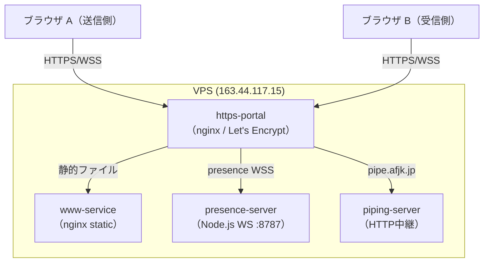
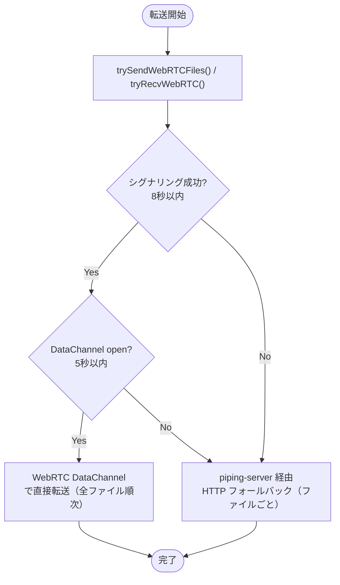
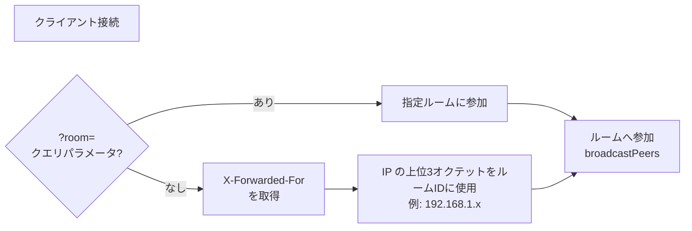
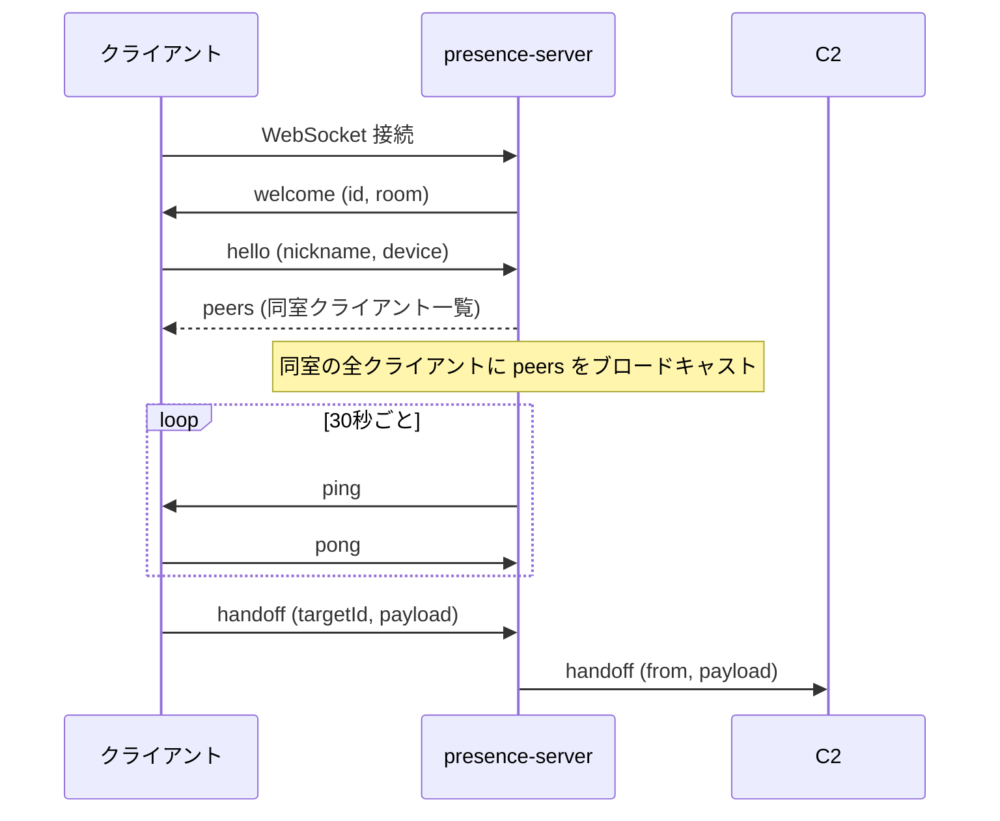
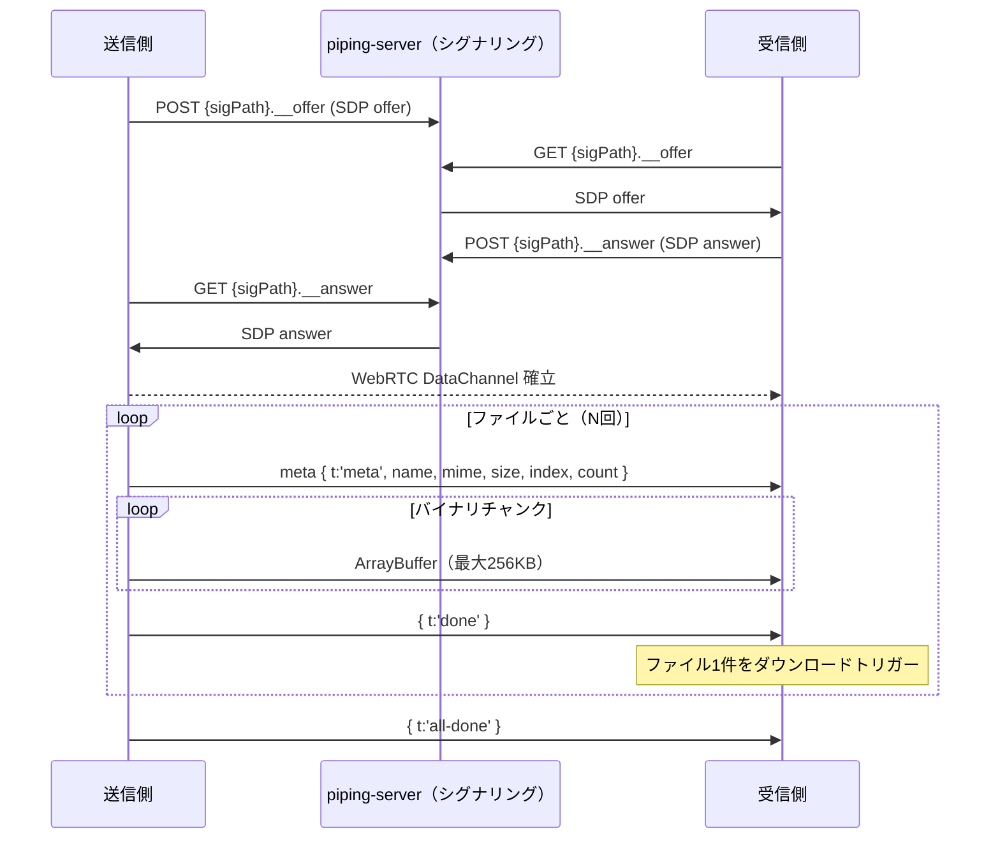
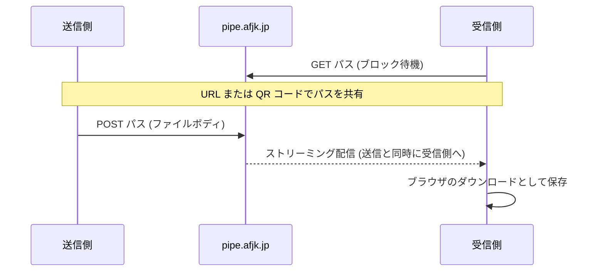
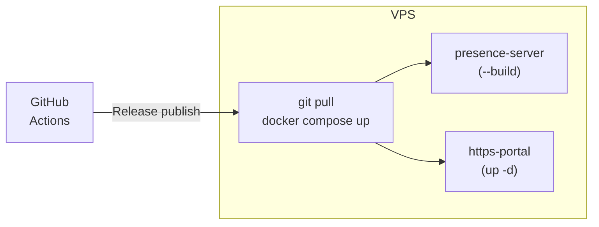
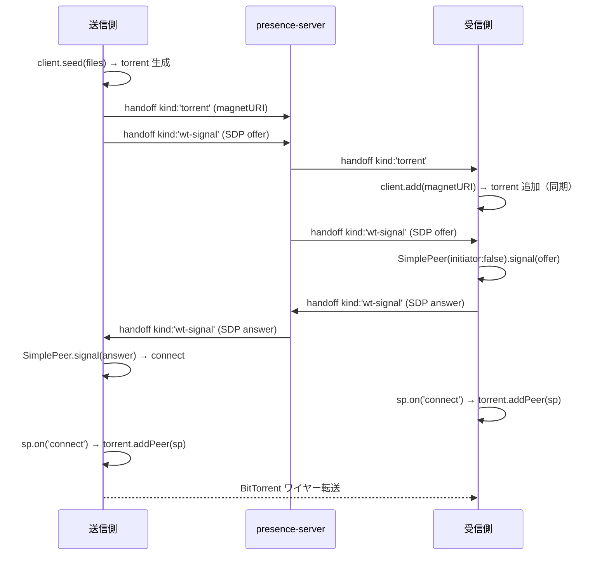

# afjk.jp/pipe — 技術仕様

## 概要

`afjk.jp/pipe` はブラウザ完結型のファイル・テキスト転送ページ。
サーバーにファイルを保存せず、ブラウザ間で直接データをやり取りする。

| 項目 | 内容 |
|------|------|
| 実装 | 単一 HTML ファイル（`html/pipe/index.html`）|
| 外部ライブラリ | qrcodejs / webtorrent / simple-peer（いずれも CDN、動的ロード）|
| 転送モード | WebRTC P2P（常に先行試行）/ piping-server 中継（フォールバック）|
| 言語切替 | JA / EN（`localStorage` 保存）|

---

## アーキテクチャ全体図



---

## 転送モードと切り替えロジック

送受信開始時、常に **WebRTC（P2P）を先に試み**、失敗したとき piping-server 経由にフォールバックする。

完了時のステータス表示でどちらの経路が使われたか確認できる：

| 表示 | 経路 |
|---|---|
| `✓ 転送完了 (P2P)` | WebRTC DataChannel による直接転送 |
| `✓ 転送完了 (中継)` | piping-server 経由の HTTP ストリーミング |



---

## 1. Presence Server（近くのデバイス検出）

### サーバー仕様

| 項目 | 内容 |
|------|------|
| 実装 | `apps/presence-server/src/server.mjs` |
| ランタイム | Node.js（外部依存ゼロ・raw WebSocket 実装）|
| ポート | 8787（内部）|
| 外部公開 | `https://afjk.jp/presence`（https-portal が WSS でリバースプロキシ）|

### ルーム分割ロジック

同一ネットワーク内のデバイスを自動的にグループ化する。



### WebSocket メッセージプロトコル



### Handoff ペイロード種別

**単一ファイル（`kind: 'file'`）**

```json
{
  "type": "handoff",
  "targetId": "<受信側のUUID>",
  "payload": {
    "kind": "file",
    "path": "abc12345",
    "filename": "photo.jpg",
    "size": 1048576,
    "mime": "image/jpeg",
    "url": "https://afjk.jp/pipe/#abc12345"
  }
}
```

**複数ファイル（`kind: 'files'`）**

```json
{
  "type": "handoff",
  "targetId": "<受信側のUUID>",
  "payload": {
    "kind": "files",
    "path": "abc12345",
    "files": [
      { "path": "abc12345", "filename": "a.jpg", "size": 102400, "mime": "image/jpeg", "url": "https://afjk.jp/pipe/#abc12345" },
      { "path": "def67890", "filename": "b.png", "size": 204800, "mime": "image/png",  "url": "https://afjk.jp/pipe/#def67890" }
    ]
  }
}
```

**テキスト（`kind: 'text'`）**

```json
{
  "type": "handoff",
  "targetId": "<受信側のUUID>",
  "payload": {
    "kind": "text",
    "path": "abc12345"
  }
}
```

**WebTorrent マグネット通知（`kind: 'torrent'`）**

```json
{
  "type": "handoff",
  "targetId": "<受信側のUUID>",
  "payload": {
    "kind": "torrent",
    "magnetURI": "magnet:?xt=urn:btih:...",
    "fileNames": "photo.jpg, video.mp4",
    "fileCount": 2
  }
}
```

**WebRTC シグナリング（`kind: 'wt-signal'`）**

```json
{
  "type": "handoff",
  "targetId": "<相手のUUID>",
  "payload": {
    "kind": "wt-signal",
    "signal": { "type": "offer", "sdp": "..." }
  }
}
```

---

## 2. WebRTC P2P 転送

piping-server をシグナリングチャネルとして使い、ICE ネゴシエーションを行う。
ローカル・リモート問わず常に先に試みる。ICE 収集完了後の SDP を piping-server 経由で交換するため、trickle ICE は使用しない。

### 接続成否の条件

| 状況 | ICE candidate | 結果 |
|---|---|---|
| 同一 LAN | host candidate | ✅ 常に成功 |
| 別ネットワーク・一般的な NAT | srflx (STUN) | ✅ 成功することが多い |
| 別ネットワーク・Symmetric NAT（4G・企業網など） | srflx のみ | ❌ 失敗 → フォールバック |

TURN サーバーは未設定のため、Symmetric NAT 環境では P2P 確立不可。

**STUN サーバー:** `stun.l.google.com:19302`

### 単一セッションでの複数ファイル転送プロトコル

1本の DataChannel で全ファイルを順次転送する（`trySendWebRTCFiles`）。



シグナリングパスには常に **先頭ファイルのパス** を使用。受信側は `all-done` フレームまでセッションを維持する。

### フロー制御パラメータ

| 定数 | 値 | 説明 |
|------|----|------|
| `SIG_TIMEOUT` | 8,000ms | シグナリングタイムアウト（P2P 断念の閾値）|
| `ICE_TIMEOUT` | 3,000ms | ICE 収集の最大待機時間 |
| `DC_TIMEOUT` | 5,000ms | DataChannel open 待機時間 |
| `MAX_CHUNK_SZ` | 262,144 B (256 KB) | チャンクサイズ上限（Chrome基準）|
| `MIN_CHUNK_SZ` | 65,536 B (64 KB) | チャンクサイズ下限（Safari対応）|
| `FLOW_HIGH_MULT` | 32 | bufferedAmount の上限 = chunkSize × 32 |
| `FLOW_LOW_MULT` | 8 | bufferedAmountLow 閾値 = chunkSize × 8 |

実際のチャンクサイズは `pc.sctp.maxMessageSize` から動的に決定される。

---

## 3. piping-server 経由転送（フォールバック）

WebRTC が失敗した場合（Symmetric NAT 等で P2P 確立不可）、piping-server の HTTP 中継を使う。ファイルサイズ上限は **5GB**。複数ファイルの場合はファイルごとに個別パスで順次 POST する。



- 送信側が POST するまで受信側の GET はブロックされる
- ファイルはサーバーに保存されない（ストリーミング中継）
- ランダム 8 文字のパス（`Math.random().toString(36).slice(2, 10)`）で識別

---

## 4. ルームコード

同一ネットワーク外のデバイスと接続するための仕組み。

| 操作 | 挙動 |
|------|------|
| 「作成」ボタン | ランダム6文字コードを生成し自分もそのルームに参加。URL に `?room=<code>` を追加 |
| 「参加」入力 | 任意のコードを入力して接続。URL に `?room=<code>` を追加 |
| 「URL コピー」 | `?room=<code>` 付きの URL をクリップボードへ |
| 「退場」 | デフォルト（同一 IP グループ）ルームに戻る。URL から `?room=` を削除 |

ルーム変更時は WebSocket を再接続する。`applyRoomCode()` / `clearRoom()` は `history.replaceState` で URL を同期するため、リロード時も参加・退場の状態が維持される。

### WebSocket 再接続時の stale close ガード

`applyRoomCode()` は旧 ws を close してすぐ新 ws を生成する。旧 ws の `close` イベントは非同期で遅れて発火するため、`presenceState.ws !== ws` を確認して旧 ws のハンドラが新 ws の状態を上書きしないよう保護している。

---

## 5. デバイスピン留め（IndexedDB）

よく使うデバイスをピン留めして優先表示する。

| 項目 | 内容 |
|------|------|
| ストレージ | IndexedDB (`pipe-pairing` DB、`pairs` ストア）|
| キー | presence peer ID（セッション間で変わる点に注意）|
| 効果 | ピン済みデバイスをグリッド先頭に表示・1台のみ見えたとき自動選択 |
| 制限 | peer ID はページリロードごとに再払い出しされるため、セッション内限定で機能 |

> 将来的に永続デバイス ID（localStorage UUID）を導入することで、ブラウザ再起動後も自動ペアリング可能になる予定。

---

## 6. 送信元バッジ

presence 経由（handoff）で届いたファイル・テキストの受信時に、送信元端末名をプログレスバー上の `.recv-from` バッジに表示する。

- `setRecvSender(elId, name)` がバッジの表示・非表示を管理
- ステータスメッセージは転送中に上書きされるが、バッジは独立した要素のため継続表示される
- URL 入力やハッシュ自動受信など、presence を介さない手動受信ではバッジを表示しない

---

## 7. テキスト受信履歴

受信したテキストを localStorage に自動保存する。

| 項目 | 内容 |
|------|------|
| ストレージキー | `pipe.textHistory` |
| 最大件数 | 50件（超過時は古いものから削除）|
| 保存内容 | テキスト本文・受信タイムスタンプ・送信元端末名（`sender`、presence 経由の場合のみ）|
| URL 判定 | `scheme://...` 形式の場合はリンクとして表示 |
| 送信元表示 | 履歴一覧の時刻欄に「3分前 · DeviceName」形式で表示 |

---

## 8. ルーム内一斉送信（Send to All）

ルームに他のデバイスが存在するとき、ファイルタブ・テキストタブに「全員に送信 (N人)」ボタンが表示される。

### 動作

1. **パス生成**: 受信者ごとに独立したランダムパスを生成（piping-server のパスは 1 対 1 のため共有不可）
2. **handoff 送信**: 各受信者に `presenceState.ws.send()` でハンドオフを通知
3. **並列転送**: `Promise.allSettled` で全受信者への転送を並列実行
4. **フォールバック**: P2P 失敗時は `fetch POST` で HTTP 中継にフォールバック

```
全員に送信ボタン押下
  ├─ 受信者 A: handoff → trySendWebRTCFiles([freshFiles_A]) or fetch POST
  ├─ 受信者 B: handoff → trySendWebRTCFiles([freshFiles_B]) or fetch POST
  └─ 受信者 C: handoff → trySendWebRTCFiles([freshFiles_C]) or fetch POST
           ↓ Promise.allSettled
       "N台に送信しました"
```

ステータス表示は「N台に送信中…」→「d/N 完了…」→「N台に送信しました」と進捗に応じて更新される。

---

## 9. URL スキーム

| 形式 | 例 | 用途 |
|------|-----|------|
| `afjk.jp/pipe/#<path>` | `afjk.jp/pipe/#abc12345` | 受信用 URL（QR コード付き）|
| `?room=<code>` | `afjk.jp/pipe/?room=team01` | 特定グループへの Presence 参加 |
| `?presence=<ws-url>` | `?presence=ws://localhost:8787` | Presence エンドポイントの上書き（開発用）|

ハッシュ付きで開いた場合は `startReceive()` が自動実行される。

---

## 10. localStorage / IndexedDB 利用一覧

| キー / DB | 種別 | 内容 |
|---|---|---|
| `pipe.deviceName` | localStorage | 端末の表示名 |
| `lang` | localStorage | 言語設定（`ja` / `en`）|
| `pipe.textHistory` | localStorage | テキスト受信履歴（最大50件、各レコードに `text` / `ts` / `sender` を保存）|
| `pipe-pairing` DB | IndexedDB | ピン留めデバイス情報 |

---

## 11. Presence エンドポイント解決

```
本番環境（afjk.jp）:
  wss://afjk.jp/presence
  └─ https-portal が /presence を presence-server コンテナ（:8787）へプロキシ

ローカル開発（localhost）:
  ws://localhost:8787
  └─ presence-server を直接参照
```

---

## 12. デプロイ構成



- `main` ブランチへのマージ → `staging.afjk.jp` へ自動デプロイ
- GitHub Release 作成 → `afjk.jp`（本番）へデプロイ

---

## 13. ルームに共有（実験的）

WebTorrent + SimplePeer による BitTorrent 方式のファイル転送。ルーム内に他のデバイスがいるときにのみ「ルームに共有」ボタンが表示される。外部トラッカーは使用しない（`tracker: false`）。

### 外部ライブラリ

| ライブラリ | 読み込み方式 | タイミング |
|---|---|---|
| `webtorrent` (CDN) | ES Module dynamic `import()` | 「ルームに共有」ボタン押下時のみ |
| `simple-peer` (CDN) | `<script>` タグ（UMD）| 「ルームに共有」ボタン押下時のみ |

### 転送フロー

プレゼンスサーバーを `wt-signal` ハンドオフ経由のシグナリングチャネルとして使い、SimplePeer で WebRTC 接続を確立してからトレントを接続する。



### ルーム保持リスト（swarm list）

受信タブに「ルームで保持中のファイル」セクションを表示。ルーム内で共有中のトレントを一覧し、任意のタイミングでダウンロードできる。

#### プロトコル（handoff payload の追加 kind）

| kind | 方向 | 内容 |
|---|---|---|
| `swarm-publish` | ブロードキャスト | 新規トレントをルーム全員に通知 |
| `swarm-request` | 新参者 → 既存ピア | 入室時に一覧を要求 |
| `swarm-sync` | 既存ピア → 新参者 | 現在の一覧を返す |
| `swarm-join` | ダウンロード開始者 → シーダー | SimplePeer 接続を要求 |
| `swarm-seeder` | シーダー → ルーム全員 | シード状態の変化を通知 |

#### 動作仕様

- 新規参加者は入室直後に全ピアへ `swarm-request` を送信。最初に応答したピアが `swarm-sync` で一覧を返す
- ダウンロードボタン押下時に `swarm-join` を送ってシーダーに SimplePeer 接続を要求し、`wt-signal` 経由でピア接続を確立
- 送信者がルームを離れたらそのエントリは削除（`swarm-seeder` で追跡）
- ブラウザは `pipe-swarm` IndexedDB に「保持ファイル」のメタデータ（infoHash, ファイル名など）だけ保存し、同じ infoHash は重複登録しない。ルーム参加時に自身の catalog を `swarm-catalog` で共有するが、実ファイルは再送しない（ダウンロード不可）
- presence-server 側には保存しない

### 実装上の注意点

- `client.add(magnetURI)` はコールバックではなく**同期的な戻り値**を使用。コールバックはメタデータ取得後（= ピア接続後）に発火するため、ピアがいない状態では永遠に呼ばれない（デッドロック）
- WebTorrent がピアタイムアウトでトレントを自動削除しても `client.get()` のキャッシュに残ることがある。`receiveTorrent()` では `existingTorrent.destroyed` と `client.torrents.includes()` で生死を確認し、古い参照を削除してから再追加する
- `wt-signal` がトレント追加前に届いた場合は `_wtPendingSignals` キューに積み、`client.add()` 直後に処理する
