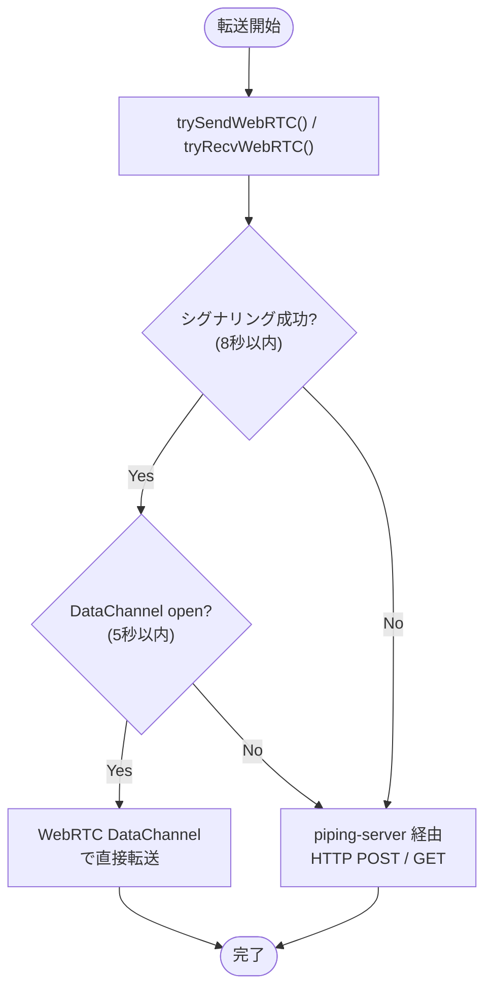
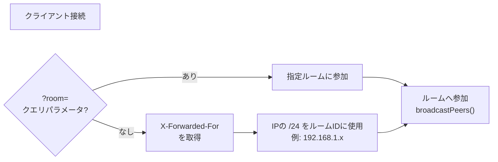
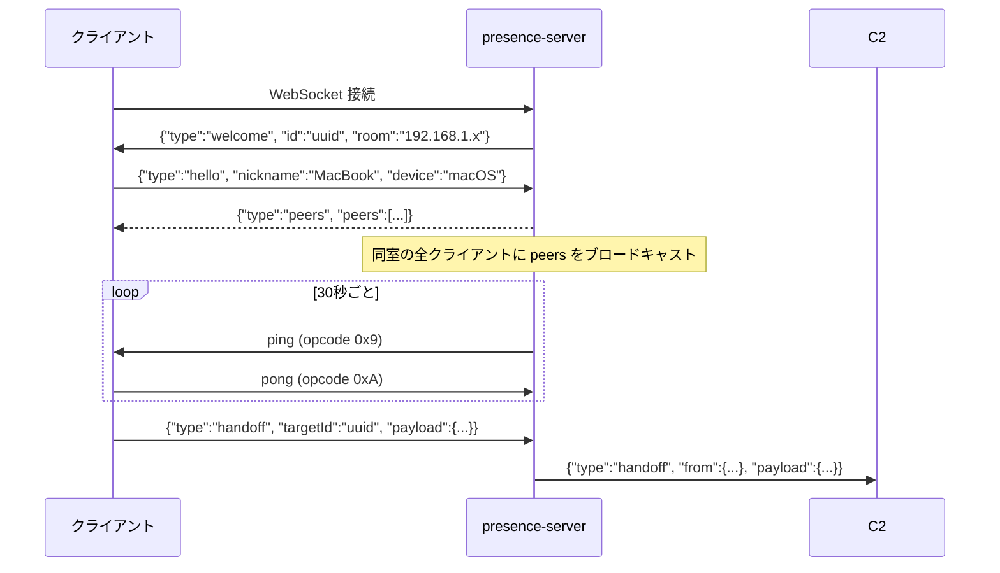
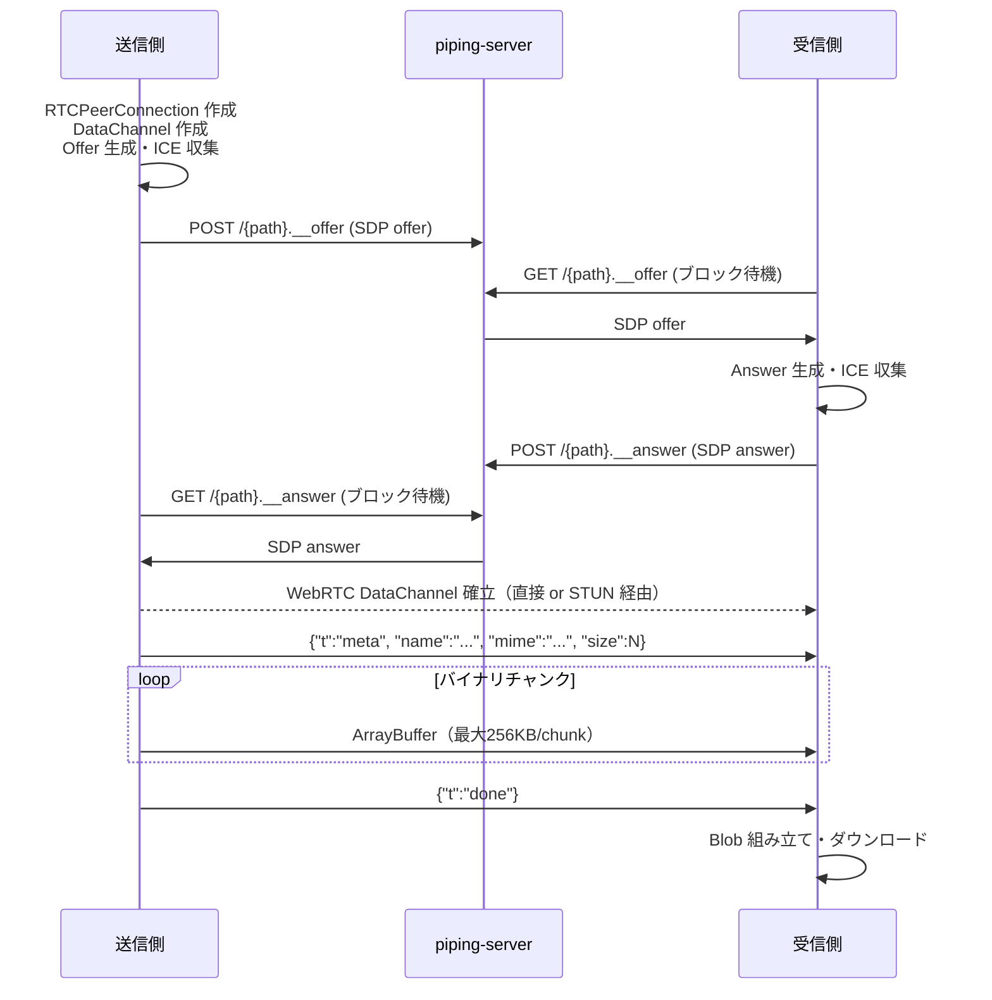
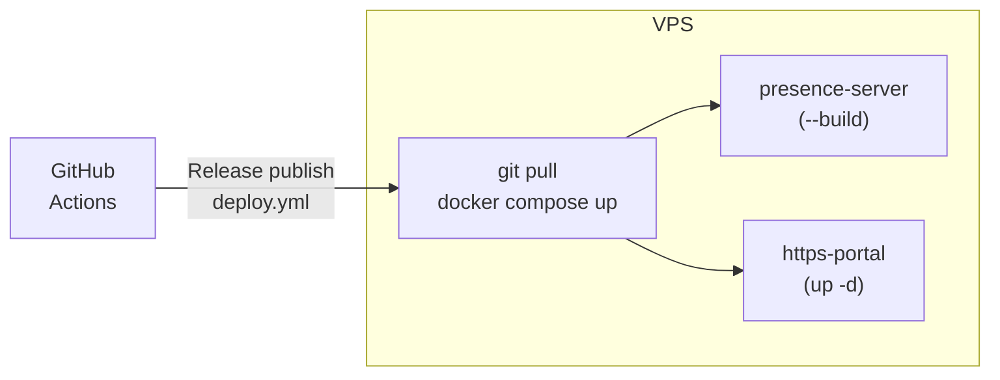

# afjk.jp/pipe — 技術仕様

## 概要

`afjk.jp/pipe` はブラウザ完結型のファイル・テキスト転送ページ。
サーバーにファイルを保存せず、ブラウザ間で直接データをやり取りする。

| 項目 | 内容 |
|------|------|
| 実装 | 単一 HTML ファイル（`html/pipe/index.html`）|
| 外部ライブラリ | qrcodejs（CDN）のみ |
| 転送モード | ローカル P2P（WebRTC）/ リモート中継（piping-server）|
| 言語切替 | JA / EN（`localStorage` 保存）|

---

## アーキテクチャ全体図

```mermaid
graph TB
    Browser1["ブラウザ A（送信側）"]
    Browser2["ブラウザ B（受信側）"]

    subgraph VPS["VPS (163.44.117.15)"]
        Portal["https-portal\n（nginx / Let's Encrypt）"]
        WWW["www-service\n（nginx static）"]
        Presence["presence-server\n（Node.js WS :8787）"]
        Piping["piping-server\n（HTTP中継）"]
    end

    Browser1 -->|"HTTPS/WSS"| Portal
    Browser2 -->|"HTTPS/WSS"| Portal
    Portal -->|"/"|  WWW
    Portal -->|"/presence (WSS)"| Presence
    Portal -->|"pipe.afjk.jp"| Piping
```

---

## 転送モードと切り替えロジック

送受信開始時、常に **WebRTC（P2P）を先に試み**、失敗したとき piping-server 経由にフォールバックする。



---

## 1. Presence Server（近くのデバイス検出）

### サーバー仕様

| 項目 | 内容 |
|------|------|
| 実装 | `apps/presence-server/src/server.mjs` |
| ランタイム | Node.js（外部依存ゼロ・raw WebSocket 実装）|
| ポート | 8787（内部）|
| 外部公開 | `https://afjk.jp/presence`（https-portal が WSS でリバースプロキシ）|

### ルーム分割ロジック

同一ネットワーク内のデバイスを自動的にグループ化する。



### WebSocket メッセージプロトコル



### Handoff ペイロード（ファイル通知）

```json
{
  "type": "handoff",
  "targetId": "<受信側のUUID>",
  "payload": {
    "kind": "file",
    "path": "abc12345",
    "filename": "photo.jpg",
    "size": 1048576,
    "mime": "image/jpeg",
    "url": "https://afjk.jp/pipe/#abc12345"
  }
}
```

---

## 2. WebRTC P2P 転送（ローカルネットワーク）

piping-server をシグナリングチャネルとして使い、ICE ネゴシエーションを行う。
同一 LAN の場合は STUN で直接接続が確立され、データはサーバーを経由しない。



### フロー制御パラメータ

| 定数 | 値 | 説明 |
|------|----|------|
| `SIG_TIMEOUT` | 8,000ms | シグナリングタイムアウト（P2P 断念の閾値）|
| `ICE_TIMEOUT` | 3,000ms | ICE 収集の最大待機時間 |
| `DC_TIMEOUT` | 5,000ms | DataChannel open 待機時間 |
| `MAX_CHUNK_SZ` | 262,144 B (256 KB) | チャンクサイズ上限（Chrome基準）|
| `MIN_CHUNK_SZ` | 65,536 B (64 KB) | チャンクサイズ下限（Safari対応）|
| `FLOW_HIGH_MULT` | 32 | bufferedAmount の上限 = chunkSize × 32 |
| `FLOW_LOW_MULT` | 8 | bufferedAmountLow 閾値 = chunkSize × 8 |

実際のチャンクサイズは `pc.sctp.maxMessageSize` から動的に決定される。

---

## 3. piping-server 経由転送（リモート・フォールバック）

WebRTC が失敗した場合（異なるネットワーク間など）、piping-server の HTTP 中継を使う。

```mermaid
sequenceDiagram
    participant A as 送信側
    participant P as pipe.afjk.jp
    participant B as 受信側

    B->>P: GET /{path}（ブロック待機）

    Note over A,B: URL または QR コードでパスを共有

    A->>P: POST /{path}<br>Content-Type: application/octet-stream<br>Content-Disposition: attachment; filename="..."
    P-->>B: ストリーミング配信（送信と同時に受信側へ流れる）
    B->>B: ブラウザのダウンロードとして保存
```

- 送信側が POST するまで受信側の GET はブロックされる
- ファイルはサーバーに保存されない（ストリーミング中継）
- ランダム 8 文字のパス（`Math.random().toString(36).slice(2, 10)`）で識別

---

## 4. URL スキーム

| 形式 | 例 | 用途 |
|------|-----|------|
| `afjk.jp/pipe/#<path>` | `afjk.jp/pipe/#abc12345` | 受信用 URL（QR コード付き）|
| `?room=<code>` | `afjk.jp/pipe/?room=team01` | 特定グループへの Presence 参加 |
| `?presence=<ws-url>` | `?presence=ws://localhost:8787` | Presence エンドポイントの上書き（開発用）|

ハッシュ付きで開いた場合は `startReceive()` が自動実行される。

---

## 5. Presence エンドポイント解決

```
本番環境（afjk.jp）:
  wss://afjk.jp/presence
  └─ https-portal が /presence を presence-server コンテナ（:8787）へプロキシ

ローカル開発（localhost）:
  ws://localhost:8787
  └─ presence-server を直接参照
```

---

## 6. デプロイ構成



- `main` ブランチへのマージ → `staging.afjk.jp` へ自動デプロイ
- GitHub Release 作成 → `afjk.jp`（本番）へデプロイ
